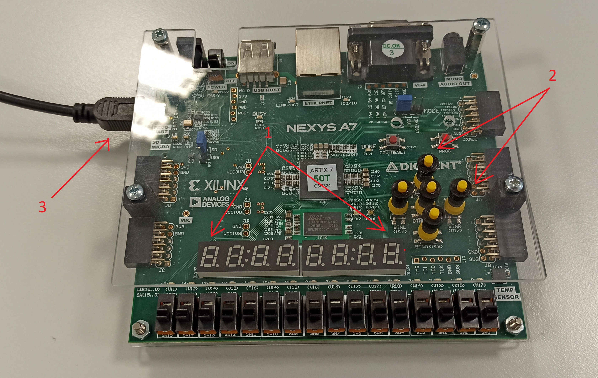
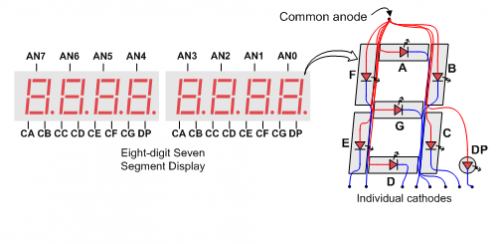
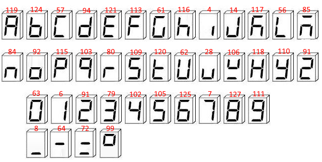
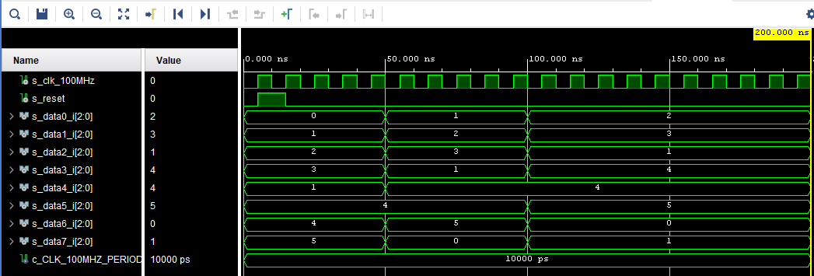

# Running text on 7-seg displays / Běžící text

### Členové týmu

* Radim Macho
* Richard Ladislav
* Vilém Pecháček

### Obsah

* [Cíle projektu](#objectives)
* [Popis hardwaru](#hardware)
* [Popis VHDL modulů a simulace](#modules)
* [Popis TOPu a simulace](#top)
* [Video](#video)
* [Diskuze o výsledcích](#discussion)
* [Reference](#references)

## Cíle projektu

Cílem našeho projektu bylo naprogramovat běžící text na 7 segmentových displejích programovatelné desky Nexys A7-5OT pomocí jazyka VHDL. 
K vývoji kódu jsme použili vývojové prostředí Vivado 2020. Naším cílem bude zobrazení slova "*de1Hello*" pomocí osmi 7 segmentových displejů. Slovo mělo defaultně písmeno po písmenu rotovat na displeji směrem zprava doleva. Docílí se tak efektu "běžícího" textu. Do programu je v plánu implementovat funkci restartu textu, kdy po stisknutí prostředního tlačítka na desce dojde k navrácení slova do počátečního stavu.

## Popis hardwaru

K realizaci projektu využijeme programovatelnou desku Nexys A7-50T. Na desce využijeme osm 7 segmentových displejů **(1)** a pět tlačítek **(5)**. Deska se napájí a programuje micro USB kabelem **(3)** připojeným k počítači. Vývojové prostředí Vivado 2020 nám umožňuje program zkompilovat a nahrát do desky.

Deska Nexys A7 obsahuje dva čtyřmístné sedmisegmentové LED displeje se společnou anodou, nakonfigurované tak, aby se chovaly jako jeden osmimístný displej. Každá z osmi číslic se skládá ze sedmi segmentů uspořádaných do vzoru viz obr. níže, přičemž v každém segmentu je zabudovaná LED. Segmentové LED diody lze rozsvítit jednotlivě, takže na číslici lze zobrazit kterýkoli ze 128 vzorů rozsvícením určitých segmentů LED a ponecháním ostatních tmavých.

Pro rozsvícení segmentu by měla být anoda ve stavu high, zatímco katoda by měla být ve stavu low. Protože však Nexys A7 používá tranzistory k přivedení dostatečného proudu do společného anodového uzlu, aktivace anody jsou invertované. Proto jsou oba signály AN0..7 a CA..G/DP, když jsou aktivní, ve stavu low.

  

Při vytváření jednotlivých písmen jsme se inspirovali níže přiloženým návrhem 7 segmentové abecedy, kterou vytvořil uživatel WH1T3_No1SE na platformě Steam.

  

## Popis VHDL modulů a simulace

### 

Tento modul byl předpřipraven na State Machine a rotaci zaplého 7seg displeje ale jelikož náš návrh State Machine nebyl funkční byl modul předělán pouze na rotaci, alternativní rozpracované řešení je ukázáno v sekci [Reference](#references).

Podle hodnoty signálu s_cnt skterý se s modulu cnt_up_down inkrementuje se ve switchi rozhodne jaký z osmi 7seg displejů bude zapnutý, toto střídání probíhá dostatečne rychle aby se lidskému oku jevilo všech osm displejů naráz zapnuto. Zároveň při rosvícení každého jednotlivého displeje se z dataX_i nahraje aktuální hodnota (tato hodnota se měla měnit podle rotace textu po diplejích) do s_txt. Tato hodnota v s_txt se pomocí modulu 7seg_txt převede na odpovídající znak pro 7seg displej. Je zde i možnost reset, toto se provádí pomocí signálu reset v hodnotě 1 (zmáčknutí prostředního žlutého tlačítka na fyzické desce), toto zppůsoví že svítí první z osmi 7seg displejů a jsou na něm zobrazeny data v signálu data0_i.

### 

Tento modul je upravená komipe modulul ze cvičení 07-display_driver.

Na zálkadě hodnoty signálu txt_i se ve switchi vybere hodnota odpovídající znaku na 7seg displaji a nahraje se do seg_o.

### 

Tento modul je kopie modulu ze cvičení 06-counter.

Na základě hodinového signálu clk se signál s_cnt_local navyšuje o 1, je možnost přičítaní vyresetovat signálem reset s hodnotou 1, pomocí sigálu cnt_up_i lze změnit s přičítání na odečítání. Tento modul má výstup cnt_o ve kerém je nastavena aktuální hodnota s_cnt_local.

## Popis TOPu a simulace

V  máme naportované Porty pro jednotlivé segmenty 7seg displaye (CA až CG), clk CLK100MHZ což je signál generovaný samotnou deskou Nexys A7 50T, BTNC je prostřední žluté tlačítko na desce a AN což je vektor označující anody 8 7seg displejů.

Následně jsme propojili CLK100MHZ s vnitřím signálem VHDL kódu clk, BTNC na reset, jednotlivé segmenty CX na odpovídajíci seg_o(X), AN na signál dig_o a do data0_i až data7_i jsme naháli hodnoty které se následně v  převedou na konkrétnní znaky zobrazené na displaji.

## Video

https://youtu.be/I_q2I7c8m2M

## Diskuze o výsledcích

Vytyčených cílů se nám bohužel nepodařilo dosáhnout. Na 7 segmentovém displeji jsme zobrazili text "*de1Hello*", avšak nepodařilo se nám zprovoznit posouvání textu.
Požadovaného výsledku jsme nedosáhli z důvodu chyby v základním designu který nám zabral hodně času na implementaci kde námi navržená State Machine nebyla schopna správné rotace. Zjištění chyby bylo příliž pozdě na opravu celého projektu do daného termínu odevzdání.

Soubor s rozpracovaným novým designem je k nahlédnutí .

## Reference

1. https://digilent.com/reference/programmable-logic/nexys-a7/reference-manual?redirect=1
2. https://steamcommunity.com/sharedfiles/filedetails/?id=1701428356
3. Kurz: Digitální elektronika 1 (BPC-DE1 21/22L)
